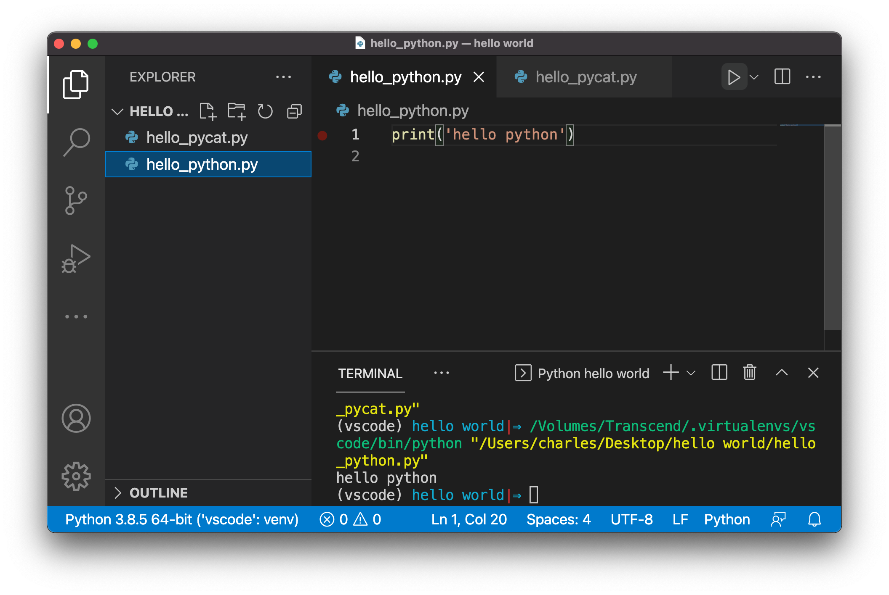
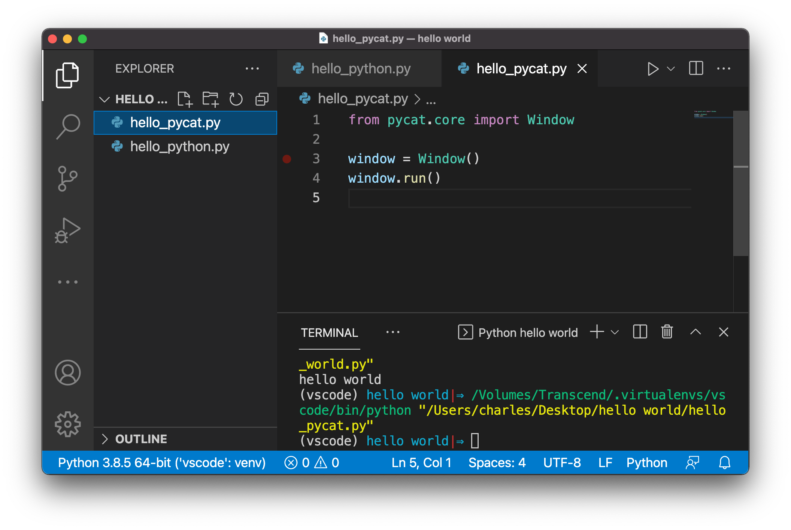

********
Homework
********

Homework 1
##########

1. Follow the instructions `here <setup.rst>`_ to set up your home computer with Python, VSCode, Git, and Pycat. 
2. Test your installation of python and pycat and take two screenshots like below.

Email your screenshots to cmorace.public@gmail.com.

Homework 2
##########

Sign up for an account on `github.com <http://github.com>`_. Then, email your Github URL (e.g. `github.com/cmorace <http://github.com/cmorace>`_.) to cmorace.public@gmail.com. Choose your username wisely. We will set up a webpage for your 108 applications where your username will be part of the URL.
