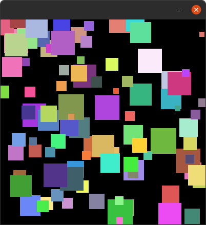

Homework 3 (Colorful Squares)
##############################

Part 1
------

Write a python program using **pycat** to create an output
like the picture below.

Hints:

-  Use a ``for`` loop to create lots of sprites.
-  Each sprite has a random position e.g. ``self.go_to_random_position()``.
-  Each sprite has a random scale, e.g. ``self.scale = randint(a, b)``. Remember to add ``from random import randint`` to be able to use the ``randint`` function.
-  Each sprite has a random color, e.g.
   ``self.set_random_color()``.

   part 1

Part 2
------

Extend your previous program so that the sprites slowly fall, as shown in the gif below.

   part 2

Part 3
------

Extend your previous program, as shown in the gif below, so that:

-  some of the sprites fall
-  some of the sprites move to the left

.. figure:: images/part3.gif
   :alt: part 3

   part 3
