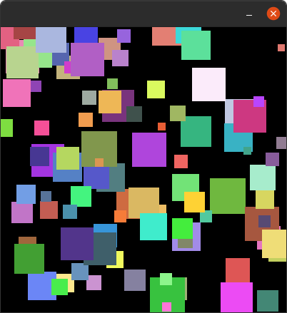

Homework 4 (Colorful Squares)
##############################

Part 1
------

Write a python program using **pycat** to create an output like the picture below.

Hints:

-  Use a ``for`` loop to create lots of sprites
-  Each sprite has a random position e.g. ``self.go_to_random_position()``
-  Each sprite has a random scale e.g. ``self.scale = randint(a, b)``
-  Each sprite has a random color e.g.
   ``self.color = Color.random_rgb()``
- You will need to import:
   - ``from pycat.core import Color``
   - ``from random import randint``

   part 1

Part 2
------

Extend your previous program so that the sprites slowly fall to the
bottom of the screen, as shown in this video.

   part 2

Part 3
------

Extend your previous program, as shown in the gif below, so that:

-  some of the sprites fall to the bottom of the screen
-  some of the sprites move to the left side of the screen

.. figure:: images/part3.gif
   :alt: part 3

   part 3
