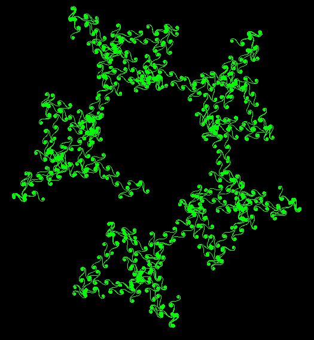
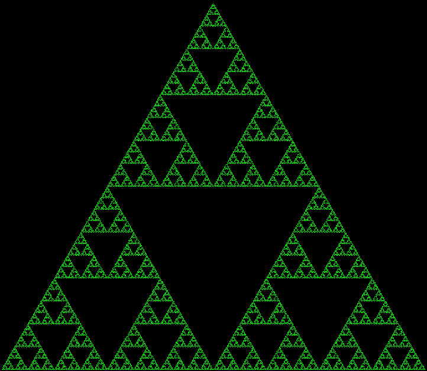

Lesson 7
############

Today we will:

 - learn about turtle graphics
 - review loops
 - learn more about functions

Turtle Graphics
=================

Similar to the Pen Tools extension in Scratch.

Useful for:

- drawing polylines
- making patterns/art

Turtle Graphics in pycat
--------------------------

In pycat, the turtle is a special kind of sprite
that can draw line segments as it moves.

Turtle Creation
^^^^^^^^^^^^^^^^^^^^^^^

.. code-block:: python

    from pycat.extensions.turtle import Turtle

    t = w.create_sprite(Turtle)

Turtle Methods
^^^^^^^^^^^^^^^^^^^^^^^
- ``turtle.turn_left(degrees: float)``
- ``turtle.turn_right(degrees: float)``
- ``turtle.pen_up()``
- ``turtle.pen_down()``

Turtle Properties
^^^^^^^^^^^^^^^^^^^^^^^
- ``turtle.pen_color``
- ``turtle.pen_width``

.. admonition:: Exercise 

   Write a program that creates a ``Turtle`` and draws a simple shape.

   - find an image to use for your turtle (make sure it faces right)
   - experiment with the turtle methods and properties listed above

------------------

For Loops
=================

.. code-block:: python

    for i in range(4):
        print(i)

What will this draw?

.. code-block:: python

    for _ in range(4):
        t.move_forward(10)
        t.rotation += 90

.. code-block:: python

    for _ in range(4):
        t.pen_down()
        t.move_forward(5)
        t.pen_up()
        t.move_forward(5)

.. admonition:: Exercise

   Draw some shapes using for loops. Possible shapes include:

   - Square
   - Regular Polygon
   - Circle
   - Star
   - Spiral

   After you finish a few different shapes, try to make them using dotted lines.

------------------

Functions
=================

Let's make a function to draw a square together:

.. code-block:: python

    def draw_square():
        pass

.. admonition:: Exercise

   Create functions for the shapes you made in the previous exercise

Function Arguments
-------------------

Part 1
^^^^^^^^^
How can we make our functions more generic/useful?

.. code-block:: python

    def draw_square(size: float):
        pass

.. admonition:: Exercise

   Rewrite your functions to be more generic

Part 2
^^^^^^^^^

What if we have multiple turtles in our file?

.. admonition:: Exercise

   Rewrite your functions to be generic

Extensions
==============

Regular Polygon
-----------------

.. code-block:: python

    def draw_regular_polygon(sides: int, side_length: float):
        pass

    def draw_regular_polygon(sides: int, side_length: float, is_dashed: bool):
        pass

User-controlled Turtle
------------------------

    .. code-block:: python

        class InteractiveTurtle(Turtle):

            def on_update(dt):
                if w.get_key(KeyCode.W):
                   pass

Homework
===========
`Homework 4 <../homework/homework04.rst>`_

