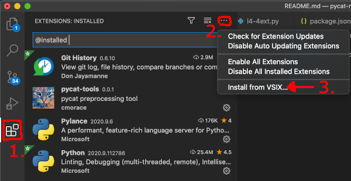

Setup
=========

You can follow the steps below to set up a programming environment similar to the one we use in class on your personal computer. Follow the installation steps in order from top to bottom.

1. Anaconda
---------------
Download the `Anaconda installer <https://www.anaconda.com/products/individual#Downloads>`_ for your operating system. Open the downloaded installer file and follow the installation steps.

.. note::

   Select the option to add Anaconda to my PATH environment variable.

   .. image:: images/anaconda.png
      :scale: 60 %
      :align: center

Anaconda comes with Python and many third-party Python packages, including a package we will use called *Jupyter Notebook*. If you downloaded Anaconda on Windows then the *Anaconda Prompt* application is also installed. 

2. Visual Studio Code
----------------------
Download and install `Visual Studio Code <https://code.visualstudio.com/Download>`_. After installing VS Code, install the `Python extension <https://marketplace.visualstudio.com/items?itemName=ms-python.python>`_.

3. Git-scm
-----------
Download `git <https://git-scm.com/downloads>`_. Run the installer and select `next` for all options.

See the video below for an example.

.. raw:: html

   <video class="align-center" width="480" controls>
   <source src="_static/git_edit.mp4" type="video/mp4">
   Your browser does not support HTML video.
   </video>
   
 

4. Pycat
---------
Install the latest version or pycat. Open the Anaconda Prompt (or other terminal application) and run the command

.. code:: bash

   pip install git+https://bitbucket.org/dwhite0/pycat.git -U

See the video below for an example.

.. raw:: html

   <video class="align-center" width="480" controls>
   <source src="_static/pycat_edit.mp4" type="video/mp4">
   Your browser does not support HTML video.
   </video>
   
 

.. Note that the installation is spead up in the video.

5. Optional Software
--------------------

Pycat-tools
^^^^^^^^^^^^^
Download pycat-tools `here <https://bitbucket.org/dwhite0/pycat/raw/master/utils/pycat-vscode-extension/pycat-tools/pycat-tools-0.0.1.vsix>`_. In VS Code's extensions view, click on the "Views and More Actions" button and then Install from VSIX...

      
Select the ``pycat-tools.vsix`` file you just downloaded.

Pylance
^^^^^^^^
Install the `Pylance Visual Studio Code Extension <https://marketplace.visualstudio.com/items?itemName=ms-python.vscode-pylance>`_ to enhance VS Code's semantic highlighting, auto-complete, and diagnostics features.
